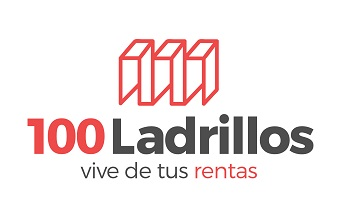
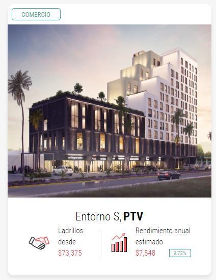

# Fintech_Case_Study
Case Study on 100-Ladrillos

# ->100 Ladrillos - Tokenization of Commercial Real Estate in Mexico<-

---

## Overview and Origin

* [100 Ladrillos](https://www.100ladrillos.com/)

* The company was incorporated in 2017.

* The founders are Hugo R Blum, Juan Pablo Mejia, and Leonardo de la Cerda

* The founders were looking for office space and found the process to be extremely difficult and expensive.  Building on their previous experience developing a P2P lending platform, the decided to establish a real estate fintech company, otherwise known as "proptech."

* The company is funded by a small Venture Capital fund in Guadalajara, Mexico.  The initial funding was $1.5 million, half of which was used to develop the Ladrillos platform.

## Business Activities:

* What specific financial problem is the company or project trying to solve?

Building off of the founder's experience developing a P2P lending platform, 100 Ladrillos hopes to democratize the commercial real estate sector in Mexico.  By placing a piece of commercial real estate into a trust and then splitting it into many digitized shares, they are able to offer a lower barrior to entry to smaller investors.  Also, because the digitized shares exist on the blockchain, they can be instantly traded without the need for the multiple intermediaries that are usually involved in a real estate transaction.  

100 Ladrillos offers the following advantages over traditional real estate purchases:

* SPEED – Properties are placed in a trust and then split into small shares, which are tokenized on the block chain.  These tokens, called ladrillos (bricks in English) can be sold instantly through their platform.

* FRICTION REDUCTION - 100 Ladrillos charges a small transaction fee on the sale of the ladrillos, but eliminates 90% of the transaction costs such as realtors and lawyers.

* BARRIERS LOWERED – Since the properties are being split into many shares, smaller investors can now afford to buy a piece of the commercial real estate market.  This also allows investors to diversify their portfolio.

* QUALITY CONTROL -100 Ladrillos acts as a property manager for all of the properties that are in their trusts.  This ensures that the property is well-maintained and tenants are vetted.  For this service, 100 Ladrillos charges a 10% commission on all rents.  

>Our mission is to democratize the real estate market, to make it accessible for the average joe who’s looking for a stable, high returns investment.
---

>We take properties and split them into equal parts (shares) that we call “Ladrillos”, the ladrillos are then made available via our marketplace where anyone can buy them. Once you have a share you’ll receive your corresponding amount of the monthly rent that the whole property generates. Our platform operates 24/7, allowing fast and bureaucracy-free transactions any day, any time of the day.

* Who is the company's intended customer?  Is there any information about the market size of this set of customers?
What solution does this company offer that their competitors do not or cannot offer? (What is the unfair advantage they utilize?)

The intended customer is a well-educated professional who is looking to get into real estate investing but does not yet have the capital to purchase entire properties.  By establishing their platform, 100 Ladrillos eliminates some of the most time-consuming parts of real estate investing, namely researching properties, physical maintenance, and rent collection.  

On the other side of the equation, 100 Ladrillos also considers real estate developers as potential customers.  By offering their platform to developers who might be searching for project funding, they are essentially becoming market makers.  As market makers they can take a small transaction fee but still remain more competitive versus traditional real estate transactions.

* Which technologies are they currently using, and how are they implementing them? 

It was difficult to determine the exact technology stack the company is using.  Based on job descriptions found on angel.co, the platform appears to built on Ruby on Rails.  It is not clear which blockchain the company has used to implement their "Ladrillos" platform.  

One interesting technology that the company relies on is the e.firma (e signature) offered by the Mexican government.  The e.firma is available to all Mexican citizens, and is essentially a verified Security Certific with public and private key.  This allows for indiviuals to conduct official financial transactions without the need for a notary or other cumbersome bureaucractic processes.  All 100 Ladrillos customers are required to use an e.firma, which ensures that the company can remain in compliance with Know Your Customer regulations preventing money laundering and other illegal activities.  

## Landscape:

* What domain of the financial industry is the company in?

100 Ladrillos operates in the commercial real estate sector, but with a technological twist.  

100 Ladrillo's founder Hugo Blum has said that he considers his company to be a hybrid.  100 Ladrillos is trying to gain the speed and agility advantages offered by blockchain transactions, but they still operate in the traditional real estate world.  This means that building still need to be maintained and rents still need to be collected from the small businesses that occupy their properties.  It is clear to Blum that simply placing the shares of the properties on the blockchain does not do away with all of the other challenges that exist in the commercial real esate sector.  

The most interesting development in the Fintech landcape in Mexico is the recent adoption of the Fintech Law.  This law regulates who can offer Fintech services and requires companies offering such services to be approved for a license.  Companies like 100 Ladrillos that are already operating as Fintech businesses have until Sept 2019 to get licensed.  100 Ladrillos recently submitted its formal application and is awaiting the license.  This is obviously a major threat to their business model.  Founder Hugo Blum points out, however, that once they do obtain a license then larger investors will be able to deal with them, whereas before they were operating in a grey area of the law.

## Results

* What has been the business impact of this company so far?

The company is in its infancy and only has 4 properties available on its platform.  According to the company founder Hugo Blum, they have 12 additional properties in the pipeline waiting to be released once their license to operate as a Fintech is formalized.  

## Recommendations

* The primary problem facing 100 Ladrillos is that they are a technology company that has almost by accident entered into the real estate industry.  Although they do address one of the major problems facing the real esate industry, their expertise in other areas of real estate is lacking.  They need to figure out a way to concentrate solely on the technology side of the business, while letting other companies handle the real esate side (research and maintenance of buildings).  If they could provide their Platform as a Service, they would eliminate the risk of unintentionally becoming property managers when their core competency is on the technological side.

### References

<https://www.crunchbase.com/organization/100-ladrillos#section-overview>

<https://angel.co/company/100-ladrillos/>

<https://www.youtube.com/watch?v=Djs8ZpMf_0Q>

<https://www.contxto.com/en/startups/latin-americas-promising-future-for-proptech/>

<https://medium.com/@EndeavorMexico/la-revoluci%C3%B3n-del-blockchain-en-el-real-estate-b529e93bc060>

<https://www.condusef.gob.mx/Revista/index.php/usuario-inteligente/servicios-financieros/1015-el-abc-de-la-ley-fintech>

<http://thecryptolegal.com/hugo-blum-mexico/>

<https://www.linkedin.com/in/hugo-blum-c-93a9014/>

<https://www.linkedin.com/in/leonardodelacerda/?originalSubdomain=mx>

<https://twitter.com/100ladrillos?lang=en>

<https://www.gob.mx/efirma/articulos/como-funciona>

<https://www.youtube.com/watch?v=aseAjCz9Yao>

<https://angel.co/company/100-ladrillos/jobs/406445-software-engineer>

<https://angel.co/company/100-ladrillos/jobs/597999-asesor-inmobiliario>

<https://100ladrillos.zendesk.com/hc/es>

### Podcast Notes: 

<https://www.listennotes.com/podcasts/asty-podcast/episodio-14-crowdfunding-1ljNFHi-B72/#1>

- technological problem easier than legal issues (7:25)

- companies in Mexico have until Sept. 10, 2019 to qualify under new Fintech law for operating license

- first investment $1.5M / 40% used first version of platform (80% tech engineering/20% legal setup). Remainder for Operating Budget

- Regulation always follows innovation.  It would be like having traffic laws before cars.

- Fintech laws allows for larger investors to enter market because it provides solid legal framework.

- Biggest obstacle was fighting "status quo".  Convincing people a new way was possible and could be profitable

- Currently only have 4 properties in the system.  Have 12 properties in the pipeline

- Also offer pre-sales of properties, which helps developers with financing.  Easier to split an office building into fractions that are 
maintained by one entity (100Ladrillos), versus having many owners that may not maintain the building to the same standards.

- Still have to go through process of Know Your Customer to prevent money laundering.
            